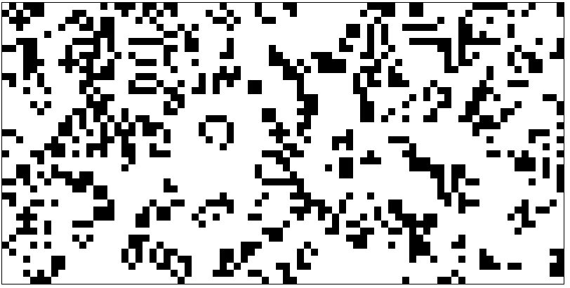

# Conway's Game of Life

A simple Python implementation of **Conway's Game of Life** using `tkinter`.

This project opens a small window and shows a grid of cells. Each cell can be either **alive** or **dead**. The simulation changes automatically based on simple rules.

## Preview


Example:



## How It Works

Conway's Game of Life is a cellular automaton.
This means the grid changes step by step depending on the state of each cell and its neighbors.

Each cell has 8 possible neighbors:

```text
⬜ ⬜ ⬜
⬜ 🟩 ⬜
⬜ ⬜ ⬜
```

The center cell checks the cells around it.

## Rules

The simulation follows these rules:

1. **Survival**
   If a living cell has 2 or 3 living neighbors, it stays alive.

2. **Death by loneliness**
   If a living cell has fewer than 2 living neighbors, it dies.

3. **Death by overpopulation**
   If a living cell has more than 3 living neighbors, it dies.

4. **Birth**
   If a dead cell has exactly 3 living neighbors, it becomes alive.

## Requirements

You need Python installed on your computer.

This project uses `tkinter`, which is included with most Python installations.

## How to Run

Clone the repository:

```bash
git clone https://github.com/your-username/GameOfLife.git
```

Go into the project folder:

```bash
cd GameOfLife
```

Run the program:

```bash
python life.py
```

## Important Note

This project opens a graphical window using `tkinter`.

Because of that, it should be run on your own computer.
It may not work directly inside GitHub Codespaces or other online terminals because they usually do not have a graphical display.


## About

This project was created to practice Python, graphical programming with `tkinter`, and the logic behind Conway's Game of Life.
